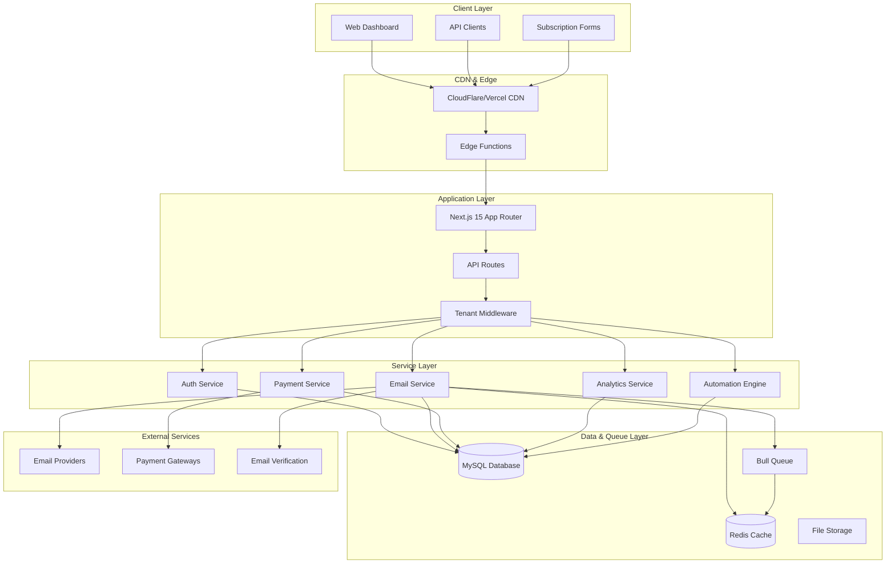

# Design Document

## Overview

This design document outlines the architecture and implementation strategy for a high-performance, multi-tenant email marketing platform built with Next.js 15. The platform is designed to handle 100,000+ concurrent users while maintaining strict tenant isolation, enterprise-grade security, and comprehensive email marketing capabilities.

The system follows a modern microservices-inspired architecture within a monolithic Next.js application, leveraging serverless functions, advanced caching strategies, and optimized database design to achieve high performance and scalability.

## Design System Components

This design is broken down into focused components for better maintainability:

### 1. UI/UX Design System

- **Color Palette**: Professional blue-based theme with semantic colors
- **Typography**: Inter font family with comprehensive scale
- **Component Library**: Modern, accessible React components
- **Layout System**: Responsive grid and spacing system
- **Design Principles**: Clean, professional, user-friendly interface

### 2. System Architecture

- **Multi-tenant Architecture**: Strict tenant isolation with subdomain/custom domain support
- **Application Layer**: Next.js 15 with App Router and API routes
- **Service Layer**: Modular services for authentication, email, payments, analytics
- **Data Layer**: MySQL with Redis caching and Bull Queue processing

### 3. Core Components

- **Authentication Service**: Multi-factor authentication with NextAuth.js v5
- **Email Campaign Management**: Drag-and-drop builder with spintax support
- **Subscriber Management**: Bulk operations with segmentation
- **Automation Engine**: Visual workflow builder with conditional logic
- **Sending Infrastructure**: Multi-provider support with domain management

### 4. Data Models

- **Database Schema**: Tenant-isolated tables with optimized indexes
- **Prisma Schema**: Type-safe ORM with proper relationships
- **API Interfaces**: Comprehensive TypeScript interfaces

### 5. Security & Performance

- **Error Handling**: Multi-layer error handling with tenant isolation
- **Performance Optimization**: Caching, connection pooling, queue management
- **Security Implementation**: RBAC, audit logging, data privacy

### 6. Testing Strategy

- **Unit Testing**: Jest with comprehensive mocking
- **Integration Testing**: API endpoint testing with tenant isolation
- **E2E Testing**: Playwright for user journey testing
- **Performance Testing**: Load testing for high concurrency

## Architecture Overview

## Key Design Principles

### 1. Tenant Isolation

- Every database query MUST include tenant filtering
- Subdomain-based tenant resolution with custom domain support
- Tenant-specific caching and file organization
- Strict data segregation at all levels

### 2. Modern UI/UX

- Clean, professional interface with Inter font family
- Consistent color palette with accessibility compliance
- Responsive design with mobile-first approach
- Intuitive navigation with contextual help

### 3. High Performance

- Optimized for 100,000+ concurrent users
- Redis caching with connection pooling
- Bull Queue for background processing
- CDN distribution for static assets

### 4. Security First

- Multi-factor authentication (Email OTP + TOTP)
- Role-based access control (RBAC)
- Comprehensive audit logging
- PCI DSS compliance for payments

### 5. Scalability

- Horizontal scaling with database sharding support
- Microservices-inspired modular architecture
- Queue-based email processing
- Auto-scaling serverless functions

## Technology Stack

### Frontend

- **Framework**: Next.js 15 with App Router
- **Language**: TypeScript (strict mode)
- **Styling**: Tailwind CSS 4 with custom design system
- **State Management**: Zustand + TanStack Query
- **Forms**: React Hook Form with Zod validation
- **UI Components**: Custom component library with Radix UI primitives

### Backend

- **Runtime**: Node.js 22
- **Database**: MySQL (latest) with Prisma ORM
- **Caching**: Redis with clustering
- **Queue**: Bull Queue with Redis
- **Authentication**: NextAuth.js v5 with JWT
- **Email**: Nodemailer with multiple provider support

### Infrastructure

- **Deployment**: Vercel/AWS with auto-scaling
- **CDN**: CloudFlare/Vercel Edge Network
- **Monitoring**: Sentry + OpenTelemetry
- **Logging**: Structured logging with ELK stack

## Implementation Approach

The implementation will follow a modular approach with clear separation of concerns:

1. **Foundation Layer**: Set up Next.js project with TypeScript, Tailwind CSS, and basic routing
2. **Authentication Layer**: Implement multi-tenant authentication with MFA support
3. **Database Layer**: Set up MySQL with Prisma and implement tenant isolation
4. **Core Services**: Build email, subscriber, and campaign management services
5. **UI Components**: Develop reusable component library with design system
6. **Advanced Features**: Implement automation, analytics, and sending infrastructure
7. **Testing & Optimization**: Add comprehensive testing and performance optimization

Each component will be developed incrementally with proper testing and documentation to ensure maintainability and scalability.
